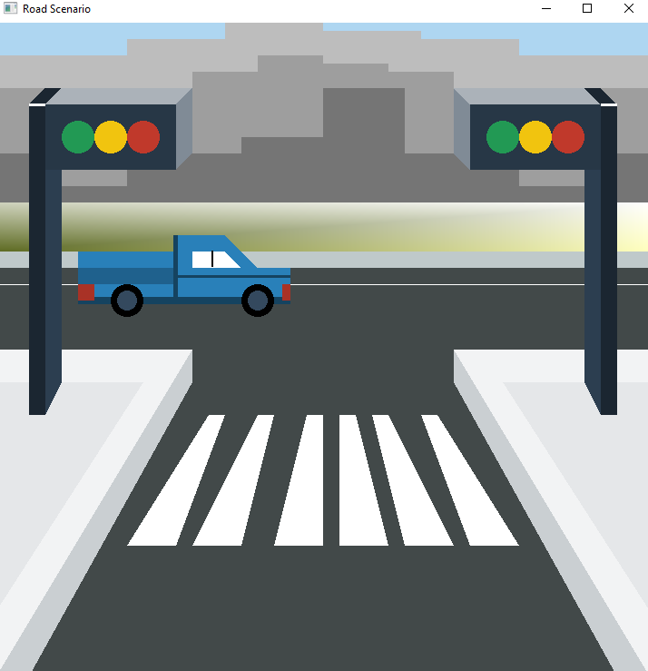
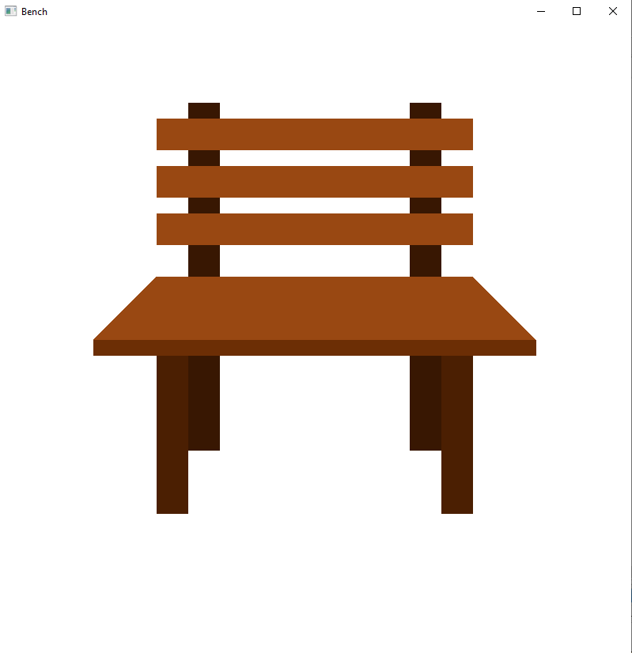

# Computer Graphics Tasks

This repository contains my lab tasks for the Computer Graphics course. The tasks are implemented using C++ and GLUT to create various designs, scenarios, and objects.

## Overview

In this course, I explore the fundamentals of computer graphics and apply them to practical lab tasks. The primary programming language used is C++, and the GLUT (OpenGL Utility Toolkit) library is employed for creating  and handling various design operations.

## How to Run

To run the lab tasks, follow these general steps:

1. Make sure you have a C++ compiler installed on your system.
2. Ensure GLUT is properly set up. You may need to install the GLUT library if you haven't already.
3. Compile the C++ source files using the provided makefile or build commands.
4. Run the compiled executable to view the graphical output.

